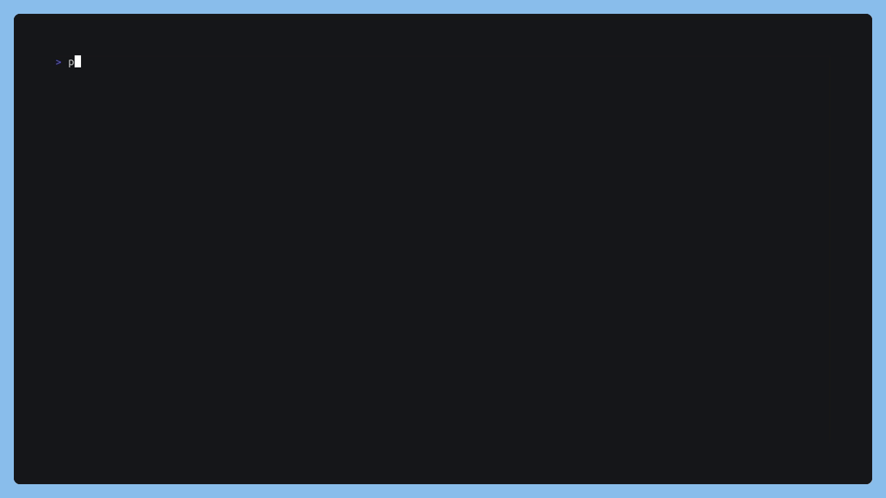

# MarkdownMapper 🗺️

Welcome to MarkdownMapper! Your directory guide in the world of markdown! 🎉


## About 📚

MarkdownMapper is a Python script that generates a `README.md` file with an index of all the non-hidden parent directories in a given directory. It's your personal compass for navigating your project directories! 🧭

## Usage 🖥️

To use MarkdownMapper, run the script with the `-d` option followed by the directory you want to map. Addtional option `-o` to specify the output file:

```bash
python3 generate.py -d <path/to/dir> -o output.md
```
If no directory is provided, the script defaults to the current directory.

<div align="center">
<h1 align="center">



## Output 📄

The script generates a `README.md` file where it's run. The file contains a markdown table listing all non-hidden parent directories in the provided directory, with a link to each one. A perfect map for your directories! 🗺️

## Example ✨

### Structure
```bash
└── /
    ├── .gitigonre
    ├── forensics/
    │   └── Trick_or_Treat_DONE/
    │       ├── capture.pcap
    │       ├── cmd.ps1
    │       ├── trick_or_treat.lnk
    │       └── untitled
    ├── images/
    ├── reverse/
    │   └── SpellBrewery_DONE/
    │       ├── flag.txt
    │       ├── get_flag.py
    │       ├── main.cs
    │       ├── rev_spellbrewery/
    ├── test.py
    └── web/
        ├── Ghostly_Templates_DONE/
        │   ├── Dockerfile
        │   ├── build-docker.sh
        │   ├── challenge/
        │   ├── config/
        │   ├── entrypoint.sh
        │   ├── flag.txt
        │   ├── get_flag.py
        │   ├── payload.html
        └── HauntMart_DONE/
            ├── flag.txt
            ├── get_flag.py
            ├── redirect.php
            ├── redirect.py
            ├── web_hauntmart/

```
This is what your directory map might look like:
### Output

| Directory | Link |
| --- | --- |
| forensics | [Link](./forensics) |
| reverse | [Link](./reverse) |
| web | [Link](./web) |


## Contributing 🤝

Contributions, issues, and feature requests are welcome! Feel free to open an issue to discuss what you would like to change or add. Let's make MarkdownMapper even better! 🚀

## License 📜

MarkdownMapper is open source and available under the [MIT License](LICENSE).

Happy Mapping! 🎉